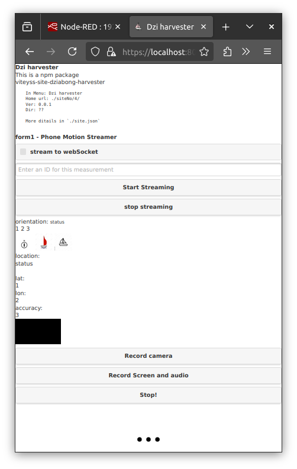

# viteyss-site-dziabong-harvester

Dziabong harvester is a site for **viteyss-site-** plugin vector implementation.
Main gool of this site is to harvest as mucho sensors / inputs / outputs on client running site as posible. Since **viteyss** can run as **SSL** / https we have access to Web Api connecting us to hardware layer by web browser.

#### for what it is

Target is to have network transparent access to inputs / outputs on devices. This site is a connection point as a access to hardware. If you alow you can give access to them on other sites or send it to node-red for processing.

#### screenshot

This is a current status of site. Me as a ui eeehh.

#### it can

- [x] gps
- [x] orientation ( heel, pitch, heading ) this is mix of accelerometers and magnetometer
- [x] mediaStream
    - [x] video
    - [x] audio
    - [ ] selector for
        - [ ] video yes / no
            - [ ] camera front / back
            - [ ] resolution
            - [ ] fps
        - [ ] sound yes / no
            - [ ] quality
- [ ] vibra
- [ ] battery
- [ ] battery temperature
- [ ] charging status
- [ ] ....

#### examples

* mediaStream to file
    You can stream media stream like video / audio and grab it to file in node-red by using flow...

    
    get [flow to import ...](./node-red-flows/mediaStreamToFile.json)

