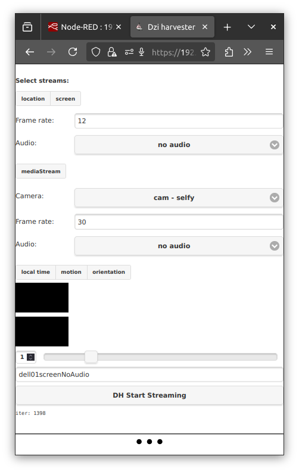
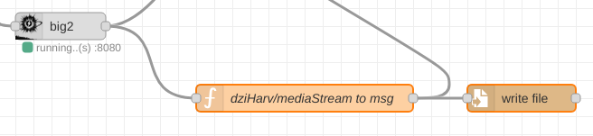
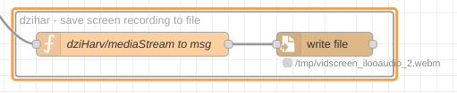

# viteyss-site-dziabong-harvester

Dziabong harvester is a site for **viteyss-site-** plugin vector implementation.
Main gool of this site is to harvest as mucho sensors / inputs / outputs on client running site as posible. Since **viteyss** can run as **SSL** / https we have access to **Web Api** connecting us to hardware layer by web browser.


#### for what it is

Target is to have network transparent access to inputs / outputs on devices. This site is a connection point as a access to hardware. If you alow you can give access to them on other sites or send it to node-red for processing.


#### installing to viteyss

To install you need to install it in your used `viteyss`. In terminal

* stop your instance of viteyss. 
* in directory where viteyss is installed install your package. 

```bash
# in directory of viteyss
npm i https://github.com/yOyOeK1/viteyss-site-dziabong-harvester.git
```

* start viteyss


#### used in projects

* **viteyss-site-3dWannd** is using dziabong-harvester to get video stream for computer vision processing 

* **blender3dWannd** for streoming video, orientation, motion, weakLock


#### screenshot

This is a current status of site. Me as a ui eeehh.



`version 250820`


#### it can

- [x] gps
- [x] weak lock on screen
- [x] battery
- [x] charging status
- [ ] battery temperature (not in web api :( )
- [x] screen recorder
    - [x] sound yes / no
        - [x] quality
- [x] mediaStream
    - [x] video
    - [x] audio
    - [ ] selector for
        - [ ] video yes / no
            - [x] camera front / back / by camera id
            - [ ] resolution
            - [x] fps
            - [x] focus
            - [ ] focus adjust remote
            - [x] zoom
            - [ ] zoom adjust remote
        - [x] sound yes / no
            - [x] quality
- [x] local time
- [x] motion accelerometers readings
- [x] orientation ( heel, pitch, heading ) this is mix of accelerometers and magnetometer
- [ ] vibra
- [ ] ambiont light
- [ ] flash light / torch
- [ ] ....

- [x] can have custom `wsCID` as sender
- [x] can send stream to `wsCID`


#### examples

* mediaStream to file
    You can stream media stream like video / audio and grab it to file in node-red by using flow...

    
    
    get [flow to import ...](./node-red-flows/mediaStreamToFile.json)


* screen recorder to file
    You can stream screen rocerding like video / audio and grab it to file in node-red by using flow...

    
    
    get [flow to import ...](./node-red-flows/screenRecorderToFile.json)


#### links

* chrome debug mobile device. Enter adress ...
    `chrome://inspect/#devices`

* https://github.com/GoogleChrome/samples/tree/gh-pages

